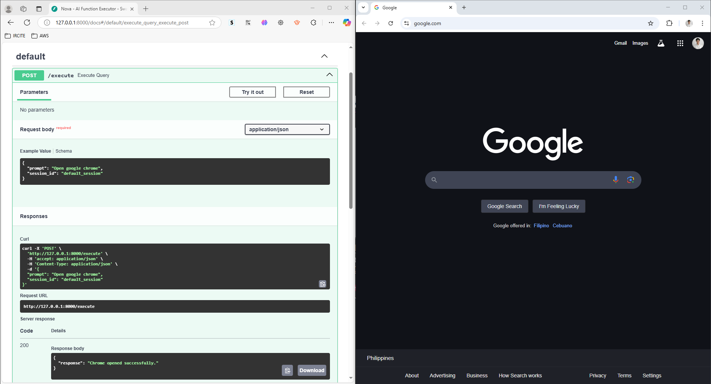
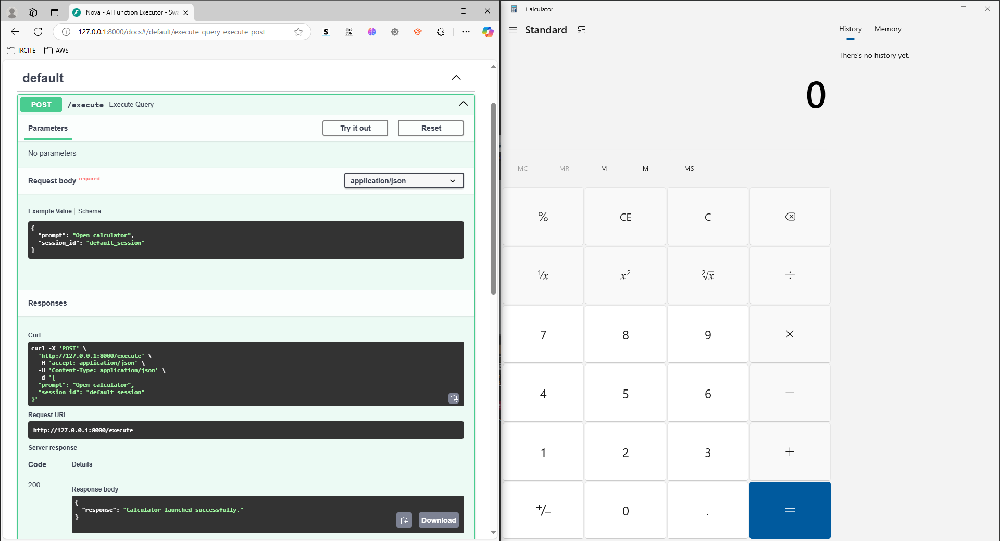
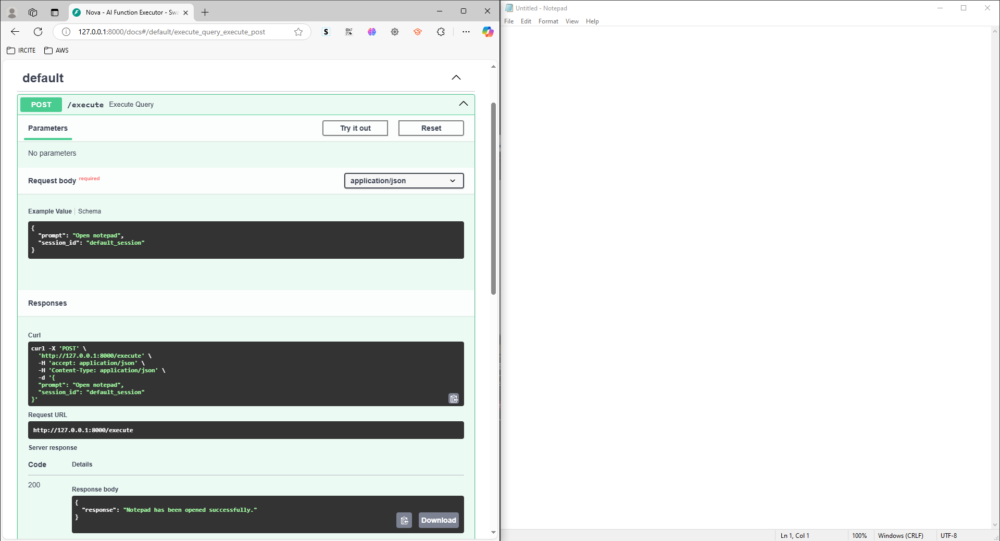
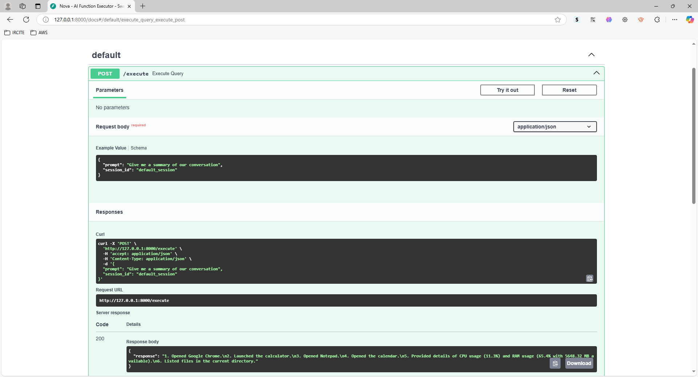

# Nova-AI - AI System Assistant

Nova-AI is an AI-powered automation agent that dynamically retrieves and executes system tasks using a combination of LLM (via LangChain and OpenAI), a vector database (ChromaDB) for function retrieval, and session-based memory for context-aware responses. The project includes comprehensive logging and monitoring via Python’s built-in logging and Langsmith.

## Features

- **Function Registry:**  
  Predefined automation functions for:
  - Application Control: Open Chrome, Calculator, Notepad, Calendar
  - System Monitoring: Retrieve CPU/RAM usage
  - Command Execution: Run shell commands

- **RAG-Based Function Retrieval:**  
  Uses LangChain's OpenAI embeddings and ChromaDB to dynamically match user queries with the most relevant function.

- **Session-Based Memory:**  
  Maintains conversation history across multiple interactions, enabling context-aware responses.

- **Logging & Monitoring:**  
  Integrated logging (via Python’s logging module) and Langsmith for detailed traceability of agent decisions.

## Project Structure

```
Nova-AI/
├── venv/                           # Virtual environment directory
├── .env                            # Environment variables (e.g., OPENAI_API_KEY)
├── requirements.txt                # Project dependencies
├── src/
│   ├── __init__.py
│   ├── agent.py                    # Main agent code and memory integration
│   ├── api.py                      # FastAPI endpoints exposing Nova's functionality
│   ├── automation_functions.py     # Predefined automation functions (tools)
│   ├── memory_manager.py           # In-memory conversation manager for session context
│   └── vector_db.py                # ChromaDB integration for function metadata and retrieval
└── README.md                       # Project documentation (this file)
```

## API Endpoints

### Execute Agent Request

**POST** `/execute`

- **Request Body:**

   ```bash
   {
     "prompt": "Open calculator",
     "session_id": "default_session"
   }
   ```

- **Response:**

   ```bash
   {
     "response": "Calculator launched successfully."
   }
   ```

## Logging and Monitoring

Nova-AI uses Python's built-in logging to record key events such as:
- Agent creation
- Incoming user messages and memory updates
- Function retrieval results from the vector database
- Assistant responses

Additionally, Langsmith is integrated via the `@traceable` decorator to provide high-level monitoring and traceability of agent invocations.

## Testing the API

You can test the endpoints using `curl`, PowerShell, or Postman. For example, using `curl` in CMD:

```bash
curl -X POST -H "Content-Type: application/json" -d "{\"prompt\": \"Open notepad\", \"session_id\": \"default_session\"}" http://127.0.0.1:8000/execute
```

## Screenshots

Below are screenshots demonstrating the various functionalities of Nova-AI. The screenshots are located in the `docs/screenshots/` folder:

- **Swagger UI Testing:**
  - Open Google Chrome Browser
  - 

  - Open System Calculator
  - 

  - Open Notepad
  - 

  - Open Calendar
  - 

  - Retrieve CPU and RAM Usage Details
  - 

  - List Files in the Current Directory
  - 
  
  - Ask for Conversation Summary
  - 

- **Langsmith Monitoring:**
  - LangSmith Logs
  - 